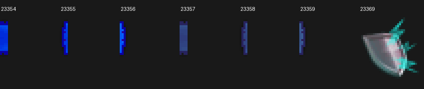

# Numeric blue zero hitmarks in revision 950

2026-09-10. Live melee already showed correct red sword damage, scaled life points, HP bars and animations. The requested adjustment is specifically a blue numeric zero for no damage. No HP values, positive hit types, client preferences, combat rolls or death behavior change.

## Paired cache proof

The native hitmark formatter `0x14033E1B0` substitutes `%1` when present. A literal `0` remains `0`. The normal opcode8 string decoder and the direct-definition path are unchanged. Config index2/group46 contains the following fully consumed records:

| Relation | Direct ID | Literal raw bytes | SHA-256 |
| --- | --- | --- | --- |
| Source or victim | 458 | `080030000a000a010007055b3a045b3b065b3c0e002809003214000a00` | `fa0aacc41d29bd6dff34074609ad960b98c821320aff31299820e63d47775a0c` |
| Other viewer | 464 | `080030000a000a010007055b3d045b3e065b3f0e002809003214000a00` | `fc0ba0f97fa3c173c16ac9841ff20a2702b1b46055bf2f80f4b8cf17a484956a` |

Both have text `0`, font7, vertical offset10, fade40 and lifetime50 native cycles. They have no varbit or varp selector. Their denominator10 does not affect a literal zero, and these definitions are never selected for positive damage.

The cache's zero wrappers independently establish the relationship:482 uses style varbit51110 and targets `[422,458,458,458,422]`;492 uses observer style varbit51111 and targets `[428,464,464,464,428]`. Direct458/464 therefore require no client-setting changes. The previous wrappers141/158 select8/113 and22/123 respectively, and all four of those records now contain `Dodged`; toggling their varbit27168 cannot produce a number.

Alternate422 has only sprite23369, a small shield/dodge icon, without numeric text; alternate428 has neither a sprite nor numeric text. They do not satisfy the requested display. No healing definition was repurposed.

## Actual blue artwork

The six selected sprite records come from **index8/groupID/file0**, exactly the runtime lookup used in `Native950Hits.verifyCache()`. Each is one4x24 sprite, using a fully consumed palette plus optional alpha stream. The bright set's opaque colours include RGB `(0,44,218)` and `(11,0,162)`; the observer set uses muted blue such as `(48,67,130)` and `(39,35,93)`. More than90% of nontransparent pixels in every selected sprite are blue by `B > max(R,G)+30`. The extracted sheet was visually inspected.

| Direct type | Sprite IDs | SHA-256 in ID order |
| --- | --- | --- |
| 458 | 23354,23355,23356 | `d01f7b914dc73f7a3c8f8232772703d4c35f4ba84c0d4ffc48f2f818d849e713`, `48473739f04cacbf0ed3f5b1edfee11faf93b1aadd732bea3d019f6e27e14327`, `234cfbafbb1ddd25a8abc633983367f03bafa18c985a1a03518f11df397b55ab` |
| 464 | 23357,23358,23359 | `8b30ecbe157012c0de26e6668f13a91901839598310dcd61b2cf9d5108509bab`, `3918f4cbae927ccb9c21e26d7198aed4e0598ecbd081385ff212bc1c63748bea`, `616a746bbdabcb22ea96b17db4e92817a0f090275fab31200051e7102bbc050a` |

This selects the existing numeric-zero style, including its native font7 and blue backing, while retaining modern standard red damage0/14. It does not claim that every hit shares one configurable client style.

## Runtime mapping and wire regressions

`Native950Hits` selects458/464 only when damage equals0. Positive damage still uses0/14 and multiplies engineHP by10. The source/victim/observer relation is unchanged. Exact definition and sprite SHA pins prevent a swapped cache from silently changing this display; the successful check is cached by store identity. Strict mismatches throw and permissive research mismatches remain refused.

The typed smart ID is now two bytes:458 = `81 ca`,464 = `81 d0`. Updated `Native950MeleeRenderingTest` covers source/victim/observer player frames and source/observer NPC frames, including explicit `MISSED` with zero damage:

- Player involved: `40 81 81 ca 00 00 00`; observer: `40 81 81 d0 00 00 00`.
- NPC involved: `00 00 20 ff 81 ca 00 00 00`; observer: `00 00 20 ff 81 d0 00 00 00`.

Existing nonzero byte fixtures remain unchanged. Parent integration owns the combined tests, build and live verification; this task performs no server restart.

## Reproduction

`python -B tools/verify_950_zero_hits.py --output protocol-analysis/numeric-zero-hitmarks-950-evidence.json`

Add `--sprites-image protocol-analysis/hitmark-zero-sprites-950.png` with a Python environment containing Pillow to regenerate the sheet. The script opens the paired cache read-only, checks the selector tables and direct strings, fully consumes the selected sprite format, and checks actual palette colour counts. It writes only explicitly requested evidence outputs.
